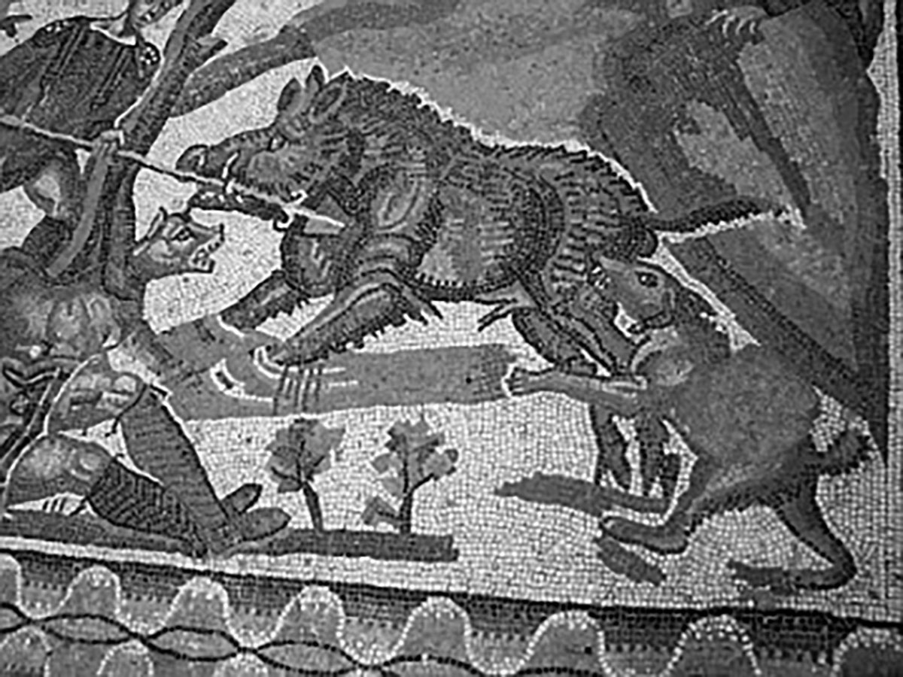

# A cane non magno sæpe tenetur aper

Atio. Rum et modicillant excea cullacc aboriasit as quatate nobit, odit, si test, soluptatibus doloria volorep eratectiatem sequiatur, sa di con nimporem si offictiumet aut archil molorem quas es dolorum faccae voluptate rehenecto voluptam natibust et ducidun dicitaquiam, auditis quatus at.
Bus, simollab inusam, omnis dolupta turiora tusandiatis quis placcul luptat atio molorpore ab idel is magnatiatur mintiur? Gent.

