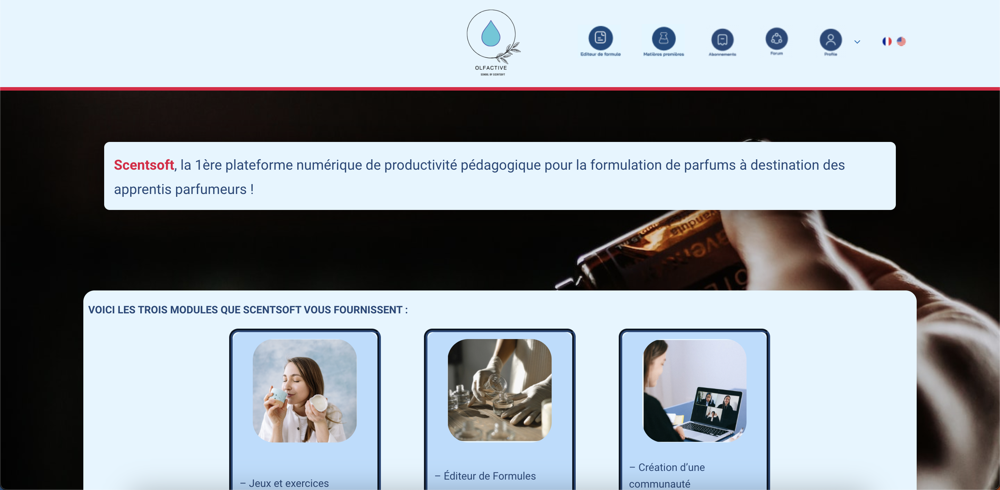
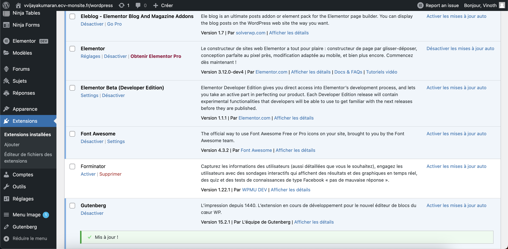
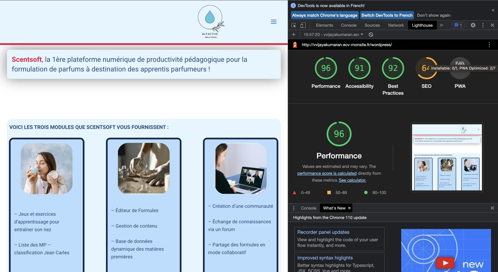
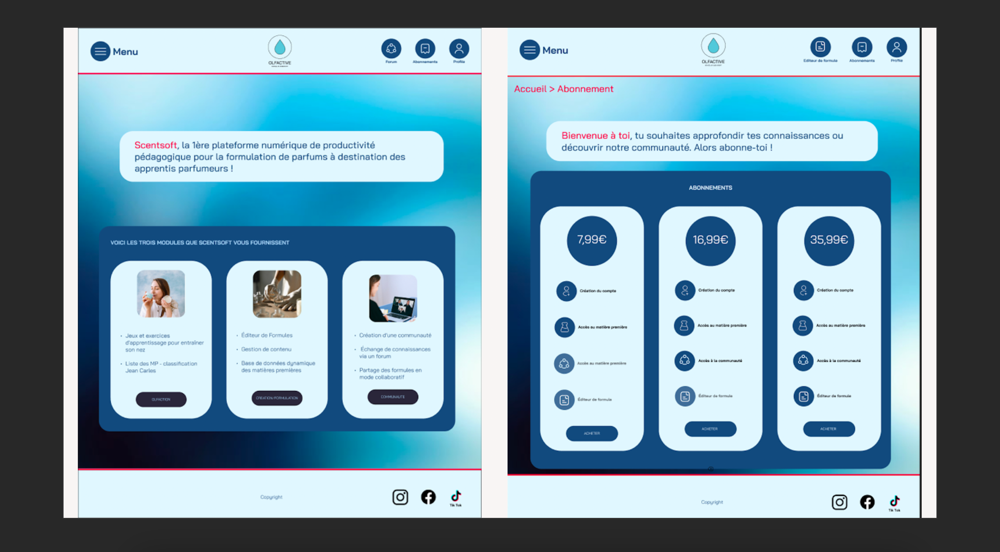

# Notre solution 

Une page web développer en Wordpress: 

## La page d'accueil

On retrouve ci-dessous, la page d’accueil du site web Scentsoft, nous avons pour cela établi une charte graphique que vous trouverez en annexe. La palette de couleurs choisies et la police d’écriture ont été respectées et utilisées sur tout le site.  Il y a dans la navbar, les liens vers les pages, éditeur de formule, matières premières, abonnement, forum, profile et le choix de la langue (français/ anglais).
Également, sur la page d’accueil on aperçoit ci-dessous les différents modules que Scenstsoft nous fournissent. Ces trois modules sont cliquables est permettent d’atterrir sur leurs pages respectives. C’est-à-dire que le module communauté en cliquant sur le bouton « communauté », nous serons redirigées sur une page dédier au forum.

## Les extensions utilisées

**Approche technique** 

Pour l’approche technique, voici des captures d’écrans, des différentes extensions que nous avons utilisées.
Nous sommes en train d’utiliser bbPress afin de développer la partie forum, de plus nous utilisons Gutenberg qui est un plugin de l’éditeur Wordpress, pour avoir plus de fonctionnalités. Ninja forms est l’extension qui nous permet de créer les formulaires que nous avons mis en place dans la page « nous contacter ».
Par la même occasion, ninja table est l’extension qui nous a permis d’afficher la table des matières premières. 
Pour finir, wp-members est l’extension qui permet de créer un compte ou de se connecter afin de restreindre l’accès au site pour les utilisateurs. 

## Les performances 
Pour la version ordinateur, la performance équivant à 96%, nous avons un SEO à 64%, donc qui équivaut à un referencement correct. De plus, on observe 91% pour l’accessibilité.

## Nos maquettes 
Avant de développer le site nous avouns réaliser les maquettes suivantes : 

## Les abonnements 

Concernant les options de chaque abonnement nous avons mis des fonctionnalités à titre informatif lors du développement afin d’afficher la différence et les restrictions de chaque abonnement. Cependant l’abonnement école se fera uniquement sur devis avec les nombres d’accès qui sera demandé et les fonctionnalités que l’institut demandera. De plus on ajoutera à cela une option de contact afin d’échanger avec nos clientes pour pouvoir répondre aux questions.

