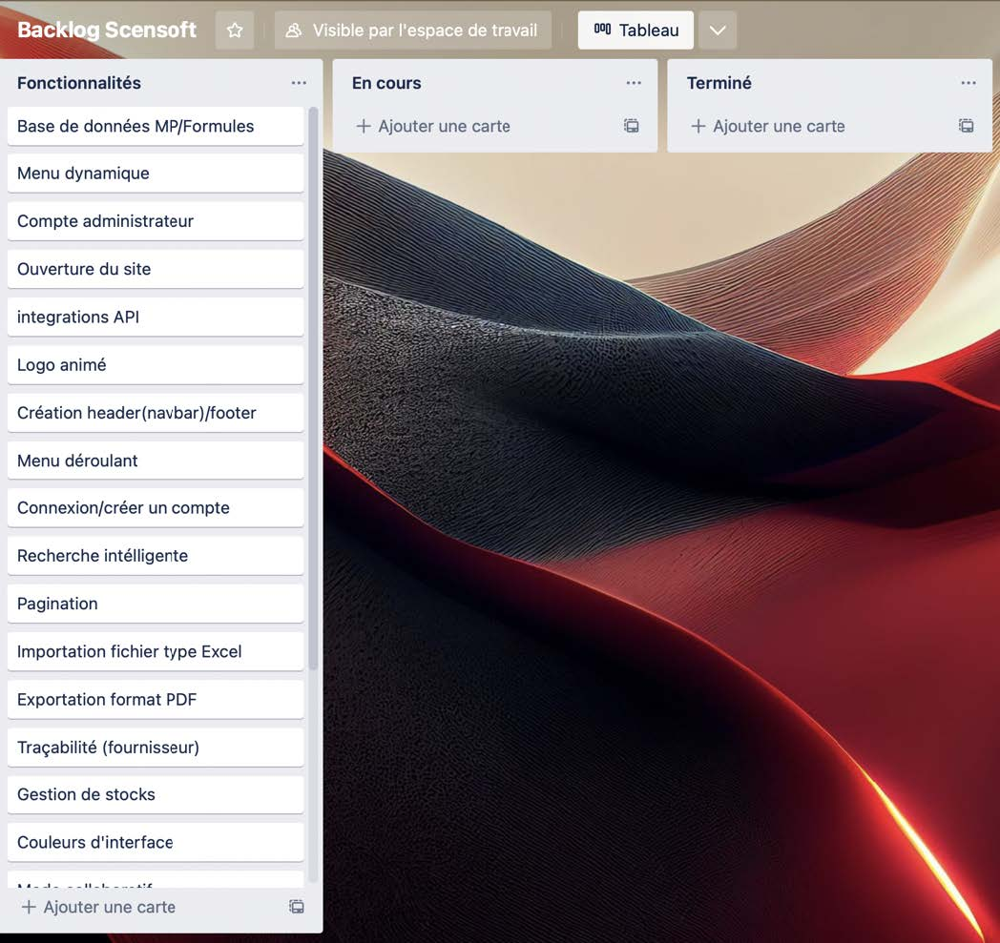
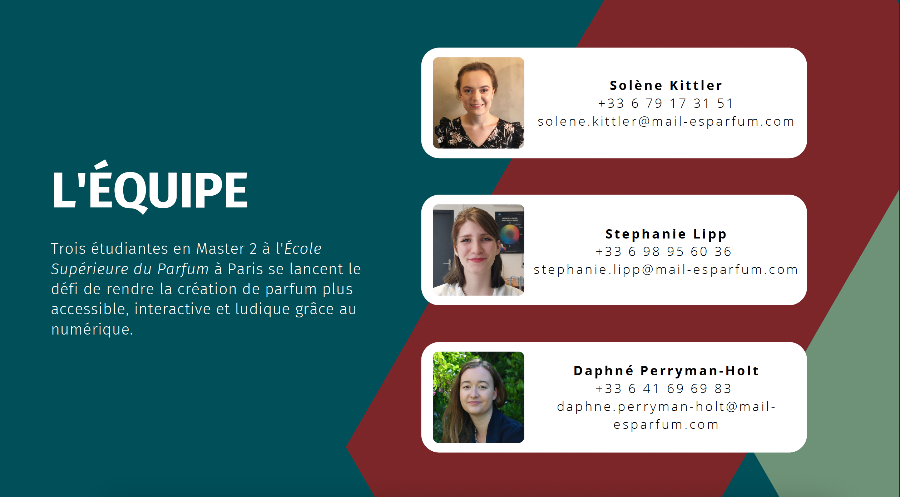

# Le Projet Scentsoft 

## Le Projet en bref
Le projet en bref est de faire évoluer et moderniser l’apprentissage de la composition des
parfums en rendant la création de parfum plus accessible, interactive et ludique grâce au
numérique.
## Le groupe de travail
Le nom de notre équipe est Olfactive Corporation.
Nos particularités, c’est que nous sommes motivés, à l’écoute, soif d’apprentissage, sociable.
Nous mettons en avant les soft skills et les hard skills car ses deux compétences combiner
rendrons un travail complet.
Étant dans la découverte et dans l’apprentissage, nous voulons mettre à profit du projet
Scentsoft toutes nos expériences et nos compétences afin de réaliser ce projet avec succès
grâce à nos intervenants dans les différentes matières à l’ECV Digital.
Dans le cadre du projet, nos clientes sont 3 étudiantes qui sont Solène Kittler, Stéphanie Lipp
et Daphné Perryman-Holt en Master 2 à l’école Supérieur du Parfum à Paris.
## Le contexte
Actuellement en 3ème année de Bachelor Chef de Projet Digital, en Spécialisation
développement Web. Nous avons pour mission de réaliser ce projet Scentsoft afin de valider
notre année.
# Enjeux

## Problématique
Le problème que nous cherchons à résoudre avec cette plateforme est d’aider les étudiants
et les autodidactes à simplifier l’archivage des formules et matières premières, de déployer
une communauté d’entraide et de rendre du temps à la créativité.

## Objectifs

Quand la plateforme sera en place, la nouvelle situation sera la suivante :
Un acheminement de dossier bien organisé, afin de se retrouver plus facilement, si nous
rencontrons des problèmes par la suite. Cependant, obtenir une interaction dynamique et
communautaire entre étudiants et les autodidactes.

# Les clientes : 

