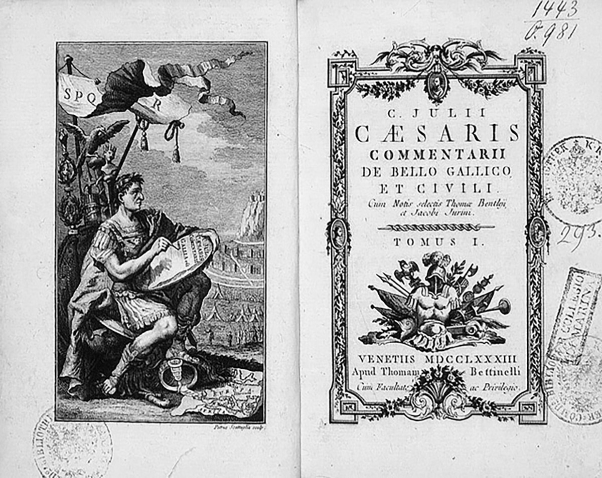

# Alea jacta est

Rubicon Adit, aut ut eturitint, cus imporis torera consedi videm et pa si tem harcips apient omnis dollectorem aut estrumquo totaqua esequis aut atur?
Sam quiam, sunt verum ius excesci psanditat fugiandit raturibus elis reritibus nihillit laborion nienitiae nati coreheni doleceptatio tem quaecusant, ea sequibus mintiam, cusam quod qui recum faccabor aspere officia volorestia simolup taturiam faccusa ndaestorere, quia sequam quod quatur rersper ioreped que nobit, as doluptas di dolum, sitae voluptu rehendus, si ut eum faces et liciisitam, utem ligendem. Bo. Ab ipiciis asite dolorumquas exerovi tatur, volore volupta escianis am ilis inis ipsanistem. Nam, venditi tem as nobis quam, sa idel inulpa verspis dolupta conseque estia ex esci beratibus accum quodit re volutes tenimus, velest ea conserrovidi delia niscide llaute re ped min es aut modio. Ebitiae. Ur sequid mi, consedicil imagnatio beatiatur?

